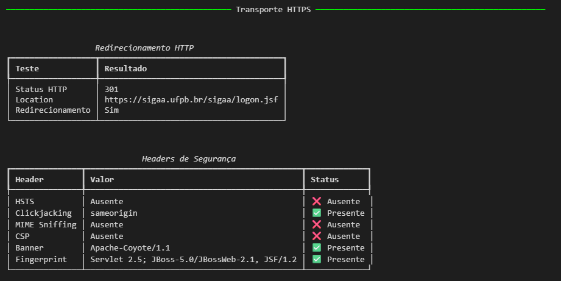
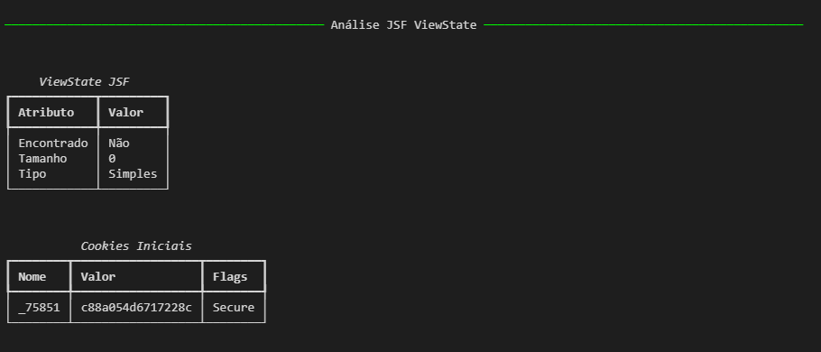
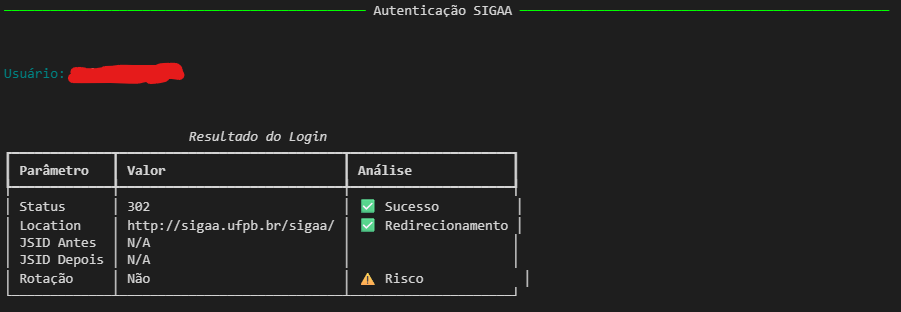
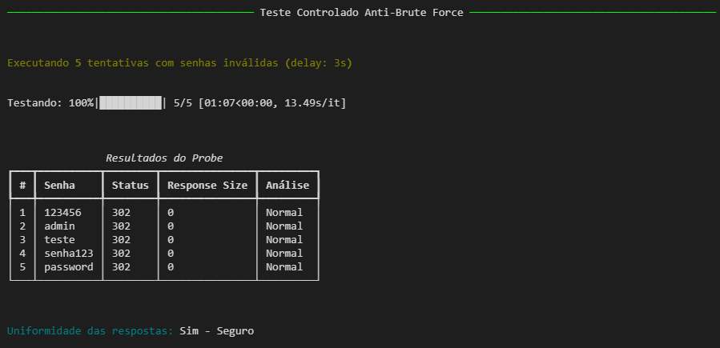
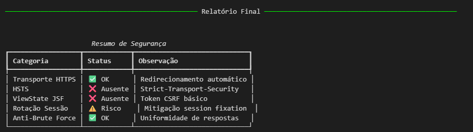
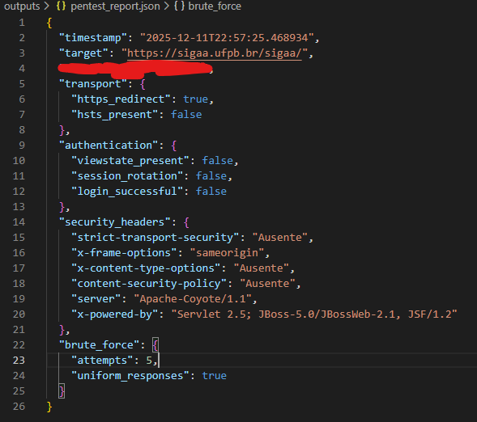

# Pentest de Autenticação – SIGAA (UFPB)

Pentest focado em autenticação para a aplicação SIGAA (`https://sigaa.ufpb.br/sigaa/`). O objetivo é avaliar segurança de login, sessão, transporte e controles associados, seguindo boas práticas (OWASP, OWASP Testing Guide, Top 10) e princípios de segurança de sistemas distribuídos.

## Escopo e Objetivos
- Alvo primário: Endpoints de autenticação e sessão do SIGAA.
- Base de teste: `https://sigaa.ufpb.br/sigaa/logon.jsf` e fluxos subsequentes (`/portal/discente/`, `/portais/discente/beta/discente.jsf`).
- Controles:
	- Transporte: configuração TLS e redirecionamentos.
	- Login: validações, proteção contra brute force, enumeração de usuários.
	- Sessão: cookies, flags e fixação de sessão.
	- Políticas de senha e lockout.
	- Exposição de banners/headers e versões.

## Metodologia (OWASP)
- Reconhecimento: Identificar hosts, rotas, headers.
- Modelagem de ameaças: Ataques a autenticação, sessão e transporte.
- Testes: OWASP ZAP, `curl`, `nmap`, `openssl`.
- Validação e evidências: Requisições/respostas anonimizadas, capturas de tela e hashes.
- Classificação de risco: Severidade baseada em impacto/probabilidade.

# SIGAA Pentest Notebook 

Este repositório contém um notebook (`pentest_sigaa.ipynb`) para executar pentest no SIGAA com metodologia OWASP.

## Setup (Bash / PowerShell)
```
# Bash (Linux/macOS)
python3 -m venv venv
source venv/bin/activate
pip install -r requirements.txt

# PowerShell (Windows)
python -m venv venv; venv\Scripts\Activate.ps1; pip install -r requirements.txt
```

Crie um arquivo `.env` na raiz com:
```
SIGAA_USER=seu_usuario
SIGAA_PASS=sua_senha
```

## Metodologia de Pentest (analítica)
- Transporte: verificação de HTTPS, HSTS e redirects.
- TLS: inspeção de certificado e versões suportadas.
- Fingerprinting: banners de `Server` e `X-Powered-By`.
- Autenticação (JSF): extração e validação de `javax.faces.ViewState`.
- Sessão: flags de `JSESSIONID` (`HttpOnly`, `Secure`, `SameSite`) e rotação pós-login.
- Brute force controlado: tentativas limitadas com intervalo e monitoramento de respostas.
- Enumeração de usuário: uniformidade das mensagens de erro.

## Visualização dos Resultados:

---

---

---

---

---
### Output Json:


## Git
- `.gitignore` inclui `venv/`, `outputs/`, `.env`, caches e checkpoints.
